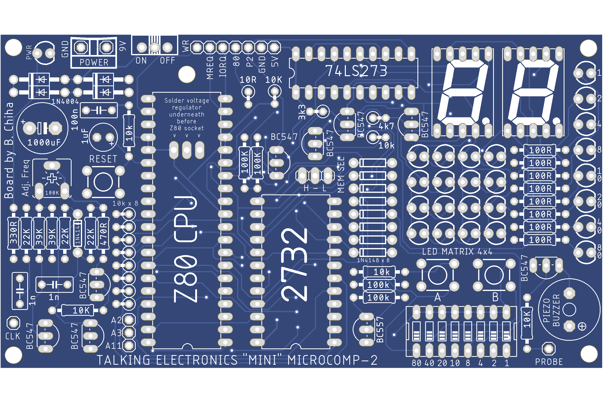

# Microcomp project information

Thank you for showing interest in this project.  This folder contains all the information needed to build the Microcomp-2.  This includes the build instructions and part list, the 4k master ROM or upper/lower 2k ROMs, circuit schematic to assist with building/fault finding and PCB Gerber files if you want to produce your own board.

For usage instructions, refer to the [documents](../documents) folder.

The first thing you should do when starting this project is to have a read of [microcomp_publication.pdf](../documents/microcomp_publication.pdf) in the `documents` folder.  Get familiar with its design.  The [schematic](microcomp_schematic.png) for this PCB is essentially identical to the original.  This will assist in fault finding if necessary.  

It is possible to plug the board into a 5V USB power supply via the 5V/GND header at the top of the board.  By looking at the schematic, components from the 7805 Voltage regulator to the 9V input can be removed if using 5V.

Also, ensure that the 74LS273 D Flip Flip is an 'LS'.  The 'HC' version will not work as one frustrated user found out.

There is a provision of two more buttons on the schematic, buttons 'C' and 'D', I haven't included these on the board as no current software uses them.  Also, I have not included an unregulated power input based on the schematic, I have added a 5V/GND header instead.

Get in contact with me if you have any questions or issues.  Hopefully, I can help.

## Build video and demonstration
I have created a video that includes the history of the board, building it and using the software.  Once you have a look, please subscribe if you would like to see more Z80 videos.

[Instructional Video Link](https://youtu.be/iamr3gj8vU8)

## Add On's
This board can accommodate Add On's via the 3272 ROM socket and the header pins at the top of the board.  Add On's are out of scope for this project.  

The Microcomp came with a few Add-On's, this was partly due to that by itself there wasn't much to do with it and the lack of onboard RAM.  Some board designs are floating around like the 4 seven segment output board, morse trainer and phone dialer.  The only one that was ever published was the Naughts and Crosses game.  I haven't typed in the code for this or built the board.  If you would like to build it, please see the [Part 3](../documents/microcomp_publication_part3.pdf) document in the documents folder.

## Burning the ROM

The Microcomp is set up to use a 4kb 2732 EPROM.  The initial Microcomp came with a 2kb lower ROM which is detailed in the publication.  No upper ROM was produced, but some larger games were published.  For completism, I added the two games published in Issue 14 and added 3 new programs to complete an upper ROM.  The 4kb binary file and both upper and lower ROMs can be found in this folder.

If you are burning/programming your own ROM, having a 4kb EPROM is ideal, but using a 2kb EEPROM will also work.  For my testing, I used a 2kb `cat28c16a` EEPROM.  If using a 2kb EEPROM, ensure that the 'MEM-SEL' header jumper is set to 'H' or High.  This will ensure that pin 21 (Write Enable) is not active.  EPROM programmers like the TL866ii Plus will work fine or if you are ultra retro you can use the TEC Eprom Burner if you have one!

## Lower 2k ROM
The Lower ROM contains the code listed in Issue 13,14 and Part 3 published by Talking Electronics.  I created a full annotation of the code.  This can be found in the [documents](../documents) folder.  But a more detailed description can be found in the mentioned publications.  

To run the code on this ROM, the input DIP switch is used.  Using an 8-way DIP switch has limitations when accessing memory over `0xFF`.  To get around this, the input is multiplied by `0x16` or shifted left by one.  Hence, `0x43` on the DIP switch will jump to memory location `0x0430`.  One compromise with this is that programs had to start in a memory location ending with a 0.  My upper ROM does away with using the DIP switch for program selection.

## Upper 2k ROM

The TE magazine talks about a future upper ROM, but nothing was ever released.  I have compiled a series of released and unreleased programs to complete the upper ROM.  The ROM contains 5 large programs.  The programs are selected by a ‘**Menu Driver**’ that removes the need to use the DIP Switch to select programs.  Cool hey!

To use the menu, Button ‘**A**’ rotates through menu items, Button ‘**B**’ selects the programs.  The menu items are displayed using scrolling Seven Segment.
**Note:** Ensure the DIP switch is set to off `(0x00)` for the menu to work.

The programs included are:

1. Blackjack -- Select playing cards, try to reach a total of 21.  When two dashes appear ‘— —‘ on the segments, press button ‘B’ to select a card, A card total appears, if the total is under 21, then another card must be selected.  If the total is over 21, you are bust and the game starts over.  If the total is 21, you win and ’21’ flashes on the segments.  Refer to issue 14.
    
2. Master Mind -- Try to guess 4 numbers in the correct sequence.  There are three phases of this game:
    1. Start. On reset or startup, press button 'A' to select a random sequence.  LED's will be randomly flashing during this time.
    2. Number select.  Two  ‘— —‘ will appear to indicate a new round has started. Button 'A' cycles through the numbers to pick.  Once a number is chosen, press button 'B' to register it.
    3. When all 4 numbers have been selected, they are repeated back and a score is displayed.  The left-hand segment shows the number of correct values in the correct position and the right-hand segment shows the number of correct values in the incorrect position.  To start a new round press button 'A', when the score is being shown.  To give up, press both buttons at the same time and the actual sequence will be shown.  You can still press the button 'A' and continue with the game.

3. NIM - Pick up Match game.  There are 23 matches and the player takes turns in removing 1, 2, or 3 matches. The object of the game is to make the computer take the last match.  The computer lets you go first. The number of matches is shown on the display. When button 'A' is pressed, a match is taken.  Up to 3 matches can be taken.  When finished, press button 'B' and the computer will do its move.  The screen will flicker when the computer is playing.  You can possibly cheat, I'll leave you to work this out.

4. Tug ‘O War - This is a game for two players.  Each player is assigned a button 'A' or 'B'.  The aim is to tap their button multiple times to increase a number from 0 to 9.  When a player reaches 9, they win and the game ends.  The numbers are displayed on the Seven Segment Displays and the left-hand display is for Button/Player 'A' and the right hand is for 'B'.  There is a catch, more button presses are needed as the number gets closer to 9 and if one player out presses the other player, their count goes higher, while the slower players count decreases.  Refer to Issue 14.

5. LED Demonstration - This is a series of LED output sequences that uses the 4x4 Matrix, Binary LEDs and the two Seven Segment displays.  The sequences alternate between singular output data and 4x4 multiplexing.  The demonstration includes animation, scrolling text and interesting sequences.  Study how the code works to make your own patterns.

